# Creating Your First Items

With a [properly setup wallet](wallet-setup.md) under your belt, it's time for you to create some items to fill that wallet with. You can opt to create these items directly using GraphQL, or by using the [Enjin SDK editor](# Using Unity) window within the Unity.

# Using GraphQL

## Creating an Item

Creating an item is like creating a template that you will use to mint your items.
To create an item, you will need to make a request with the desired item properties. Here is
an example:

[CreateToken](../examples/CreateToken.gql)


Property | Descriptions
---|---
totalSupply | Total Supply for the item
initialReserve | Initial Reserve for the item. You will need ENJ approved for this reserve.
supplyModel | Supply Model for the item. FIXED, SETTABLE, INFINITE, COLLAPSING, ANNUAL_VALUE, ANNUAL_PERCENTAGE.
meltValue | ENJ value of the item. Need to multiply value by 10^18 to include 18 decimals.  There is a minimum melt value required by new items which is calculated from the inital reserve.  You can use this TP endpoint to discover the minimum amount for any given reserve: `/api/v1/ethereum/get-min-melt-value/{iniitalReserve}` e.g. [https://kovan.cloud.enjin.io/api/v1/ethereum/get-min-melt-value/1000000](https://kovan.cloud.enjin.io/api/v1/ethereum/get-min-melt-value/1000000)
meltFeeRatio | Percentage of melt value returned to the creator (up to a maximum of 50%), up to 2 decimals. Need to multiply the percentage by 100. i.e. 12.5 % would be 1250.
Transferable | Transfer Type. PERMANENT, TEMPORARY, BOUND.
transferFeeSettings - type | Transfer Fee Type. NONE, PER_TRANSFER, PER_CRYPTO_ITEM, RATIO_CUT, RATIO_EXTRA, TYPE_COUNT.
transferFeeSettings - token_id | Token ID of the item you want to use as the transfer fee. Use 0 for Enjin Coin.
transferFeeSettings - value | Value of the transfer fee. If using ENJ, multiply the value by 10^18 to include 18 decimals.
nonFungible | Whether the item is Non-Fungible or Fungible, true or false.

Consult the "Creating Items" section of the [Unity Guide](./unity.md) to get a more detailed explanation of the item properties and how they work.

Once a successful request has been made, you will need to accept and sign the transaction in the **NOTIFICATIONS** section of your dev wallet. If the transaction is successful the
item template is created and you can move onto finding the item's id to MINT.


## Finding the Token ID (and Additional Details)

You can either find the Token ID on the transaction with that item after it confirms via EnjinX or you can search for the item on the Trusted Cloud, you will need to wait for it to be confirmed and scraped from the blockchain first.

NOTE: If you find your Token ID via the blockchain rather than the TP then it will be in integer form, you will need to convert this number to hex and take just the 'upper' 32 bits of the resulting value (which represents the Base Token ID) before using it in many of the GraphQL mutations. You can use a service such as [Rapid Tables](https://www.rapidtables.com/convert/number/decimal-to-hex.html) to do this.

[Tokens](../examples/Tokens.gql)

Enter in the `ITEM NAME` to search for that item. Alternatively, you can make the request without the name parameter to return all items on your app.

## Minting the Item

Minting items is using the template you created in the CREATE step to
instantiate some items on the blockchain. The request for minting fungible items (FIs) vs non-fungible items (NFIs) varies slightly. You can batch mint to multiple addresses if you wish to do so. The differences are that if you need to mint multiple NFIs, you will need to specify the wallet address for each individual item. Ideally try to avoid minting over 100 NFIs in a single transaction, FIs do not have this restriction. Here is the same request between 2 different items types, FI and NFI.

**FI:**
[MintFungibleItems](../examples/MintFungibleItems.gql)

This request would mint 5x items to “WALLET_ADDRESS_1” and 3x items to “WALLET_ADDRESS_2”.
You can mint up to `INITIAL RESERVE` of items.

**NFI:**
[MintNonFungibleItems](../examples/MintNonFungibleItems.gql)

This request would mint 5x items to “WALLET_ADDRESS_1” and 3x items to “WALLET_ADDRESS_2”.

Once a successful request has been made, you will need to accept and sign the transaction in the “NOTIFICATIONS” section of your dev wallet.

## Setting the URI (Item Metadata)
Item metadata is optional, but if you want to display an image and custom item properties
in the Enjin Wallet (and other Enjin Services) you will need to define some metadata.

In order to link an item to a metadata file, you will need a .json file hosted somewhere that has public read access. You can include a name (which would be displayed instead of the blockchain item name), description, and link to an image (which also needs to be publicly readable) in the .json file.

The bare minimum recommended metadata is a name, a description, and an image. You
would define this like so:

```json
{
  "name": "ITEM_NAME",
  "description": "Description line 1.\nDescription line 2.",
  "image": "/IMAGE.jpg"
}
```
Once you have that .json file uploaded with public read access, you can make the request to set the item URI. Replacing with your token_id and link to your .json file. See
[this guide](./working_with_metadata_digital_ocean.md) for more details if you are
unfamiliar with hosting files.

**Advanced Users:**
The URI value allows for ID substitution by clients. If the string `{id}` exists in any URI, clients MUST replace this with the actual token ID in hexadecimal form. This allows for large number of tokens to use the same on-chain string by defining a URI once, for a large collection of tokens. Example of such a URI: `https://token-cdn-domain/{id}.json` would be replaced with `https://token-cdn-domain/780000000000001e000000000000000000000000000000000000000000000000.json` if the client is referring to token ID `780000000000001e000000000000000000000000000000000000000000000000`. See [Metadata](https://github.com/ethereum/EIPs/blob/master/EIPS/eip-1155.md#metadata) section in the ERC-1155 standards documentation for full details.

[SetItemUri](../examples/SetItemUri.gql)


There are many other built in features for metadata built into our schema,
consult the [Enjin Metadata Schema](../erc1155_metadata_json_schema.md) for details.

Once a successful request has been made, you will need to accept and sign the transaction in the **NOTIFICATIONS** section of your dev wallet.


# Using Unity

## Before You Start

Before you start working with Unity, you'll need a Cloud Platform account.
See [here](./starthere.md) about getting one.

Also, you won't be able to do much without at least one wallet funded with ENJ or ETH
(or KENJ/KETH if on Kovan) so make sure you are stocked up before doing anything beforehand.
See [here](./wallet_quickstart.md) about that.

Lastly, it helps to think about your item economy before you do any large scale
minting of items. Test your items out on our Kovan sandbox before moving onto mainnet.
Working with crypto items involves using real money and transaction fees, and it's
best to know what kinds of costs you will incur for your items and transaction fees
**before** you need to use real money.

The Unity panel is designed to allow for non-programmers to be able to create, mint
and manage cryptoitems. However, it is **not** designed for large scale automation
and scalability for item creation. If you are creating a large number of items,
especially NFIs you should consider writing scripts using the Unity runtime API,
or the GraphQL API.

## Setup

Setup into Unity is easy. Grab the [Enjin Blockchain Asset](https://assetstore.unity.com/packages/tools/utilities/blockchain-sdk-by-enjin-124133) off the Unity Asset Store
with you open game project in Unity.

If you got the package from somewhere else import into using via Assets->Import Package->Custom Package.


Access the Unity panel via **Window->Enjin SDK**.

Login using your Enjin account that you used during Sign Up.

Once logged in you will need to create an app if you haven't already via the
dev portal. See [Home Screen](#home-screen) below, for how to do that.

Finally, you will need to link your wallet. See the [Wallet](#wallet-screen) section for
how to link your wallet to your developer account.

## Home Screen Logged Out


#### Select Platform

Use Select Platform to choose what platform you want to work with. Right now there
is only one choice:

* Kovan Testnet - Our primary testnet sandbox. `https://kovan.cloud.enjin.io/`

There will be other platforms available, including mainnet, later on.

#### Login
Accounts are server specific, so if you are having trouble logging in
make sure you are using the right credentials for your account.

### Home Screen
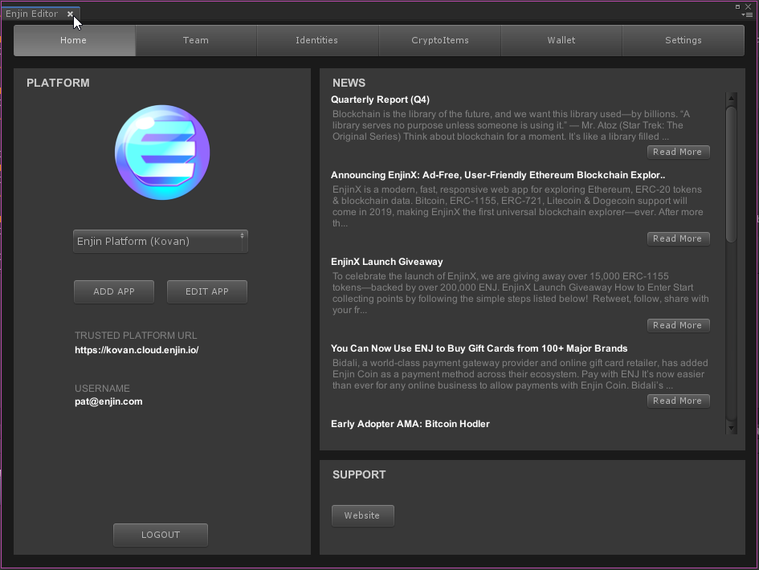

When logged in, your home screen is where you can review your login information, but is also where you manage your apps. You are going to want to have one app per game.

Click **Create App** button to add the app to you platform. You can set the name, image URL and description of the app in the fields. Make sure the image is publicly accessible for it to show up in the wallet.

Use the app drop down to select the app you want to work with for this session, and **Edit App** if you made any mistakes entering you apps.

## Team Screen
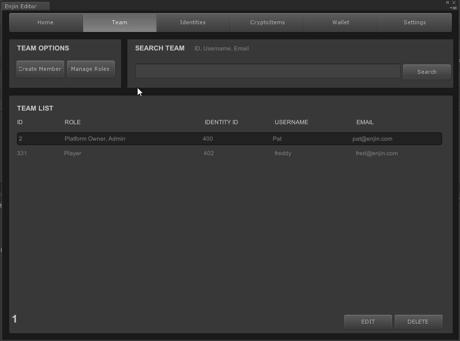

The team screen is where you create, edit and remove team members from your app. You can also see player accounts that have been added to your app as people are playing.

To create a team member, click **Create Member**. Enter a username and password for this user.

To edit an existing user, click **Edit** while the given user is selected.

You can search for users using the **Search** box.

## Identities Screen
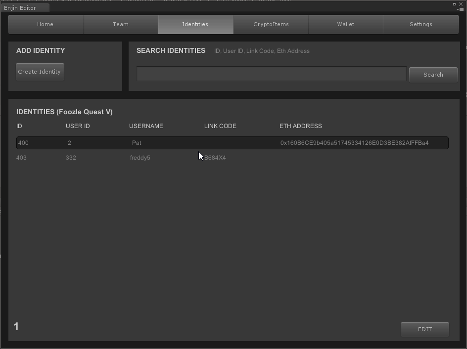

The identities screen is where you link user accounts to ethereum addresses. You are only
allowed to have one identity per user, per app. That means a user can have many identities across a variety of apps in the ENJ ecosystem.

Identities can be in one of two states: linked or unlinked. A linked identity will show a valid
public ethereum address, and unlinked address will show a six digit alphanumeric linking code.

The linking code is used by **developers** to link their mobile or wallet daemon to your app to do things like creating and distributing items.

The linking code is used by **players** to link their game account and wallet to your game via the platform.

Linking is required for developers to manage items for their app, or for players to do in-game operations like trading, if supported.


## Cryptoitems Screen


The Cryptoitems screen is the heart of the Enjin Unity SDK. This is the main screen where you create and manage your items. Before we get into the details of the process, you should know a couple of things.

#### Creation of an item is two step process:

1. First you need to **CREATE** the item. This is like crafting a cookie cutter for your cookies you
will be making.

2. Then, you need to **MINT** the item. Minting the item uses the cookie cutter to cut out some cookies.

#### There are two types of items: Fungible Items and Non Fungible Items.
* **Fungible Items** are all identical and can be considered essentially interchangeable. Gold coins,
rusty swords, ingots etc. would fall under this category. Using our cookie analogy all the cookies
would look the same. If we traded fungible cookies and mixed the cookies up, we would not be able to tell which cookies we used to trade with.

* **Non Fungible Items** are all unique items that come from a common base item. Using our
cookie analogy, it would be like decorating every cookie with a unique icing pattern. While all
the cookies share the same base, they are not considered interchangeable because of their unique
patterns. If we traded non-fungible cookies we would easily be able to identify which cookies
we traded.

There are some key workflow differences between fungible and non-fungible items that will
be highlighted as they come up in this guide.

#### Creating items
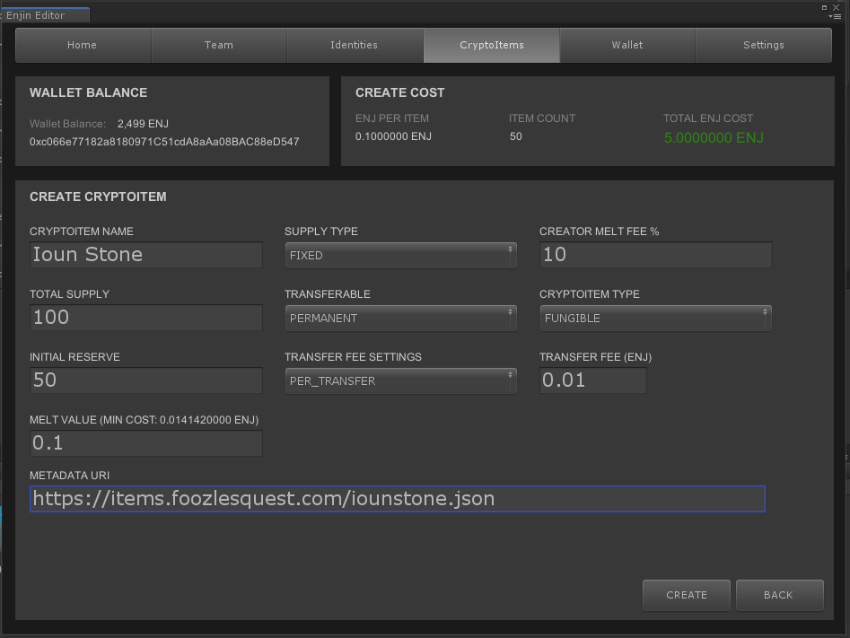

When you click **CREATE** on the main panel you will be brought to the Create Cryptoitem panel.

In the top left, you'll be able to see what wallet you are using, and the ENJ balance you have in
that wallet. If you need to change wallets, you can unlink the current wallet and link the wallet
you want to use for you create operations.

The main panel is where you determine the characteristics of your item. Let's talk about each property:

**CryptoItem Name**: Should be self explanatory. Make it good!

**Total Supply**: This is how many of the item you want to exist in the world. This limit can be
broken or mean different things depending on the supply model you use above. For example, if you
use the COLLAPSING supply type, the initial supply would represent the total number of items that
existed during the original run. The easiest to understand is FIXED, which tells users that there
can only be "this many" items of this kind in existence at any one time.

**Initial Reserve**:This is how many items you want to pre-pay to mint as part of the initial create operation. Minting items will be deducted from this balance until it is exhausted. You have to
pay for at least one item on creation. Having an initial reserve allows you to create your item without having to spend all the ENJ for your total supply on the create.

**Melt Value**
The amount of ENJ you want to use per unit of item you are creating. You need to use a minimal
amount of ENJ to back your items depending on how many you are creating in your initial reserve (the min cost will be listed beside the label). In general, the more items of one type you are making, the less ENJ you need **per unit** of item.

**Metadata URI**
See **Working with metadata** section.
The metadata URI allows you to add a URL that contains a JSON that describes properties of your item, including images.

**Supply Type**: This is how the item pool behaves with respect to minting and melting. We have the following supply types in the current version on Enjin:
  * **Fixed**: You can have up to TOTAL SUPPLY number of items in circulation at one time.
  * **Settable**: Allows you to edit the total supply at any time.
  * **Infinite**: You can mint as many items as you want, exceeding TOTAL SUPPLY.
  * **Collapsing**: Once melted the items cannot be re-minted.

**Transferable**
Determines if items are able to be traded, or are bound to their owners (i.e. non-tradable).
* **PERMANENT**: Item is always able to be traded with others.
* **BOUND**: Item is always bound to the owner of the item.
* **TEMPORARY**: Item is currently tradable, but creator can make it non-tradable at a future date.

**Transfer Fee Settings**

* **NONE**: No Transfer fees are charged when this item changes hands.

* **PER_CRYPTO_ITEM**: Transfer fee *per item* changing hands, in ENJ. For example, if an `Apple`
has a `0.1 ENJ` fee per item and `0xPAT` sends 10 apples to `0xERIC`, `0xPAT` would be charged 1 ENJ for the transaction that would go to the `0xCREATOR` of the apple.

* **PER_TRANSFER**: Transfer fee per *transfer* when changing hands, in ENJ. For example, if a `Banana` has a `0.1 ENJ` fee per transfer and `0xPAT` sends 10 bananas to `0xERIC`, `0xPAT` would
be charged 0.1 ENJ for the transaction that would go to the `0xCREATOR` of the banana.
* **RATIO_CUT**: Fungible Items only. A % cut of the total items is subtracted from the total for the dev, with the sender paying the total price. For example, if transferring 500 gold with a 10% ratio cut (0.1) the recipient would get 450 gold and the dev 50 gold, with the sender paying 500 total for the transaction.
Another example:

`day_of_subscription` has RATIO_CUT of 100 (results in 1% cut to creator)
`0xPAT` sends 10000 `day_of_subscription` to `0xERIC`
Result: `0xERIC` gets 9,900 items and `0xCREATOR` gets 100.

* **RATIO_EXTRA**: Fungible items only. A tax that is charged ON TOP of everything. For example if transferring 500 gold with a 10% ratio extra the recipient would get 500 gold, the dev 50 gold, and the sender pays 550 gold total for the transaction.
Another example:
`gold` has RATIO_EXTRA fees of 1,500 (15%)
0xPAT sends 4000 `gold` to `0xERIC`
Result: `0xPAT` loses 4,600 `gold`, `0xERIC` receives 4000, `0xCREATOR` receives 600.


**Transfer Fee (ENJ or %)**
The transfer fee, in ENJ or % of nonfungible items, based on your transfer fee settings.

**Melt Fee Ratio**
This is the current percentage of ENJ that the creator will receive when the item is melted, up to 50%.

**NONFUNGIBLE ITEM**
Are you creating a fungible, or non-fungible item.

### Fungible Item Creation Example

Let's create a fungible item called **doubloons**. We intend to use doubloons as our main, in
game currency like gold.

Go to the cryptotiems screen, and click **Create**. We fill out the values as follows:

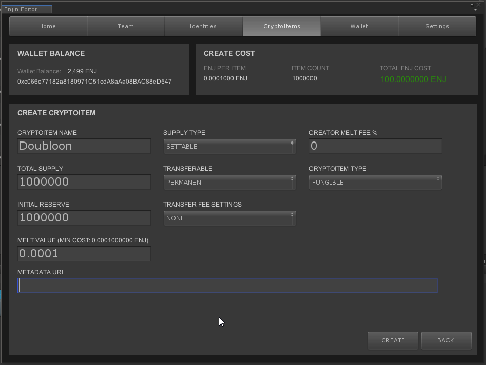

We decide to make 10 million doubloons to start, and use a supply type of SETTABLE so
we can create more if we run out and want to expand the supply later.

We set our initial reserve to the same amount as our total supply, since we plan on minting
the whole lot right away. We decide to use the minimum amount of ENJ required to make our Items
to reduce cost: the more items you make the less ENJ is needed to back each item. If you keep melt value at 0, the panel will automatically use the minimum amount of ENJ needed.

We decide that it's cool to let people trade doubloons so we set TRANSFERABLE to permanent.
Furthermore, we decide we are not going to charge any transfer fees. So we set that to NONE.

We set melt fee ratio to none. If players melt this item 100% of the ENJ used to back the
item will go back to the player.

We click CREATE. The transaction is posted to the blockchain and needs to be signed by a wallet. In this example we will be using the mobile wallet. You'll see something like this:
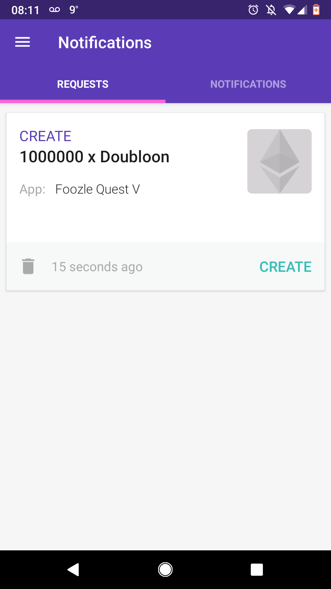

We approve the create request, after awhile (be patient) Unity will refresh and show the newly
created item:

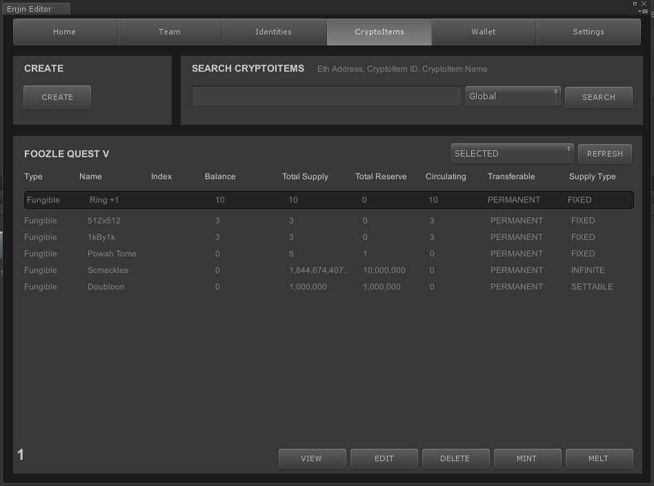

You'll notice there is 0 balance of this item. That is because we only created the
template of the item, we haven't actually minted anything yet. Let's mint by selecting
the item and selecting MINT.

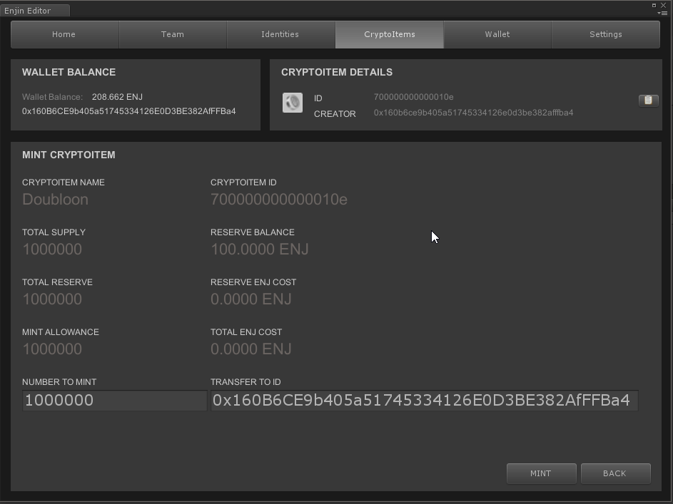

The number to mint will automatically be set to max. You can change this if you'd like. You can
also choose the address to where the minted items will go. Handy if you have something like
our wallet daemon running on a remote machine acting as a vault for items. Click MINT.

You'll get a notification in the wallet similar to this:
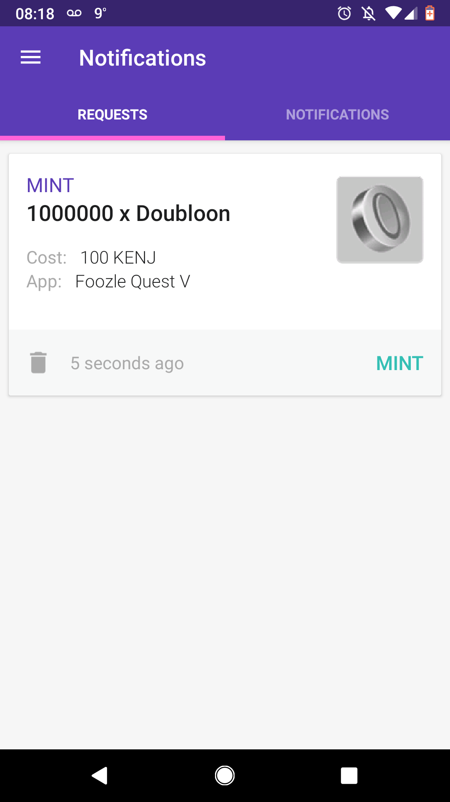

Accept it, and wait. Once the transaction is confirmed on the blockchain, Unity will refresh
and you will see your doubloons. If you minted them to your mobile wallet you'll be able to See
them in your collectibles tab.

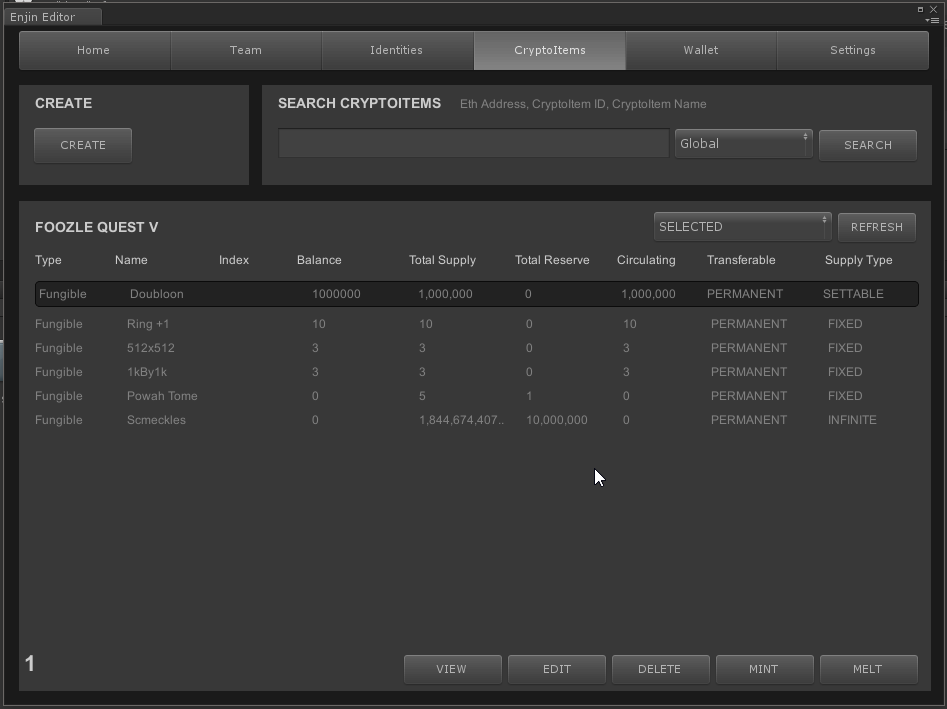

But, where are my cool item art? Descriptions? Custom stats? For that, you will need to create
and set some metadata. See the **working with metadata** section on how you can customize your items.

#### Non-Fungible Item Creation Example.

Let's create a non-fungible item called a **Vorpal Sword**. These are very rare items,
but also, each Vorpal Sword is unique, and grows in power over time. We fill out the
create screen as follows:

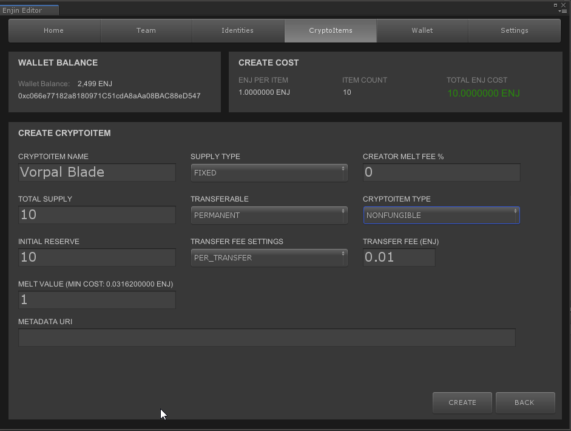

We decide that there are only 10 of these in the world, and that they will be backed
by 1 ENJ each. We are using a FIXED supply type, so there can only ever be 10 of these
items in circulation at a time (but we can melt and re-mint up to 10 items).

We decide to add transfer fees, charging a 0.1 ENJ transfer fee every time someone trades
a Vorpal Sword. Transfer fees will go to the creator of the item.

Finally, we select **NONFUNGIBLE ITEM** and click **CREATE**.

The create process is exactly the same as fungible items. Accept the create request in the wallet and wait for the Unity panel to update and get confirmation that the item was create on the blockchain.

Minting NFIs is a bit different, however. You can only mint one NFI at a time, and each NFI
mint is a separate transaction.

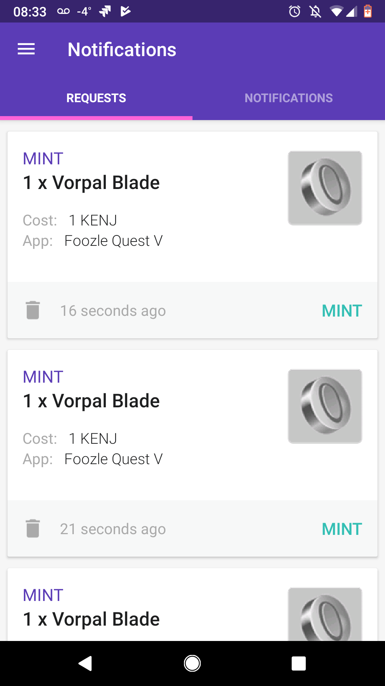

Also, each NFI will show up as it's own entry in the cryptoitem list in Unity, which makes
sense, since each NFI is a unique item.

If you are minting a large number of NFIs, you should consider streamlining the process by
using the GraphiQL console.

Finally, be mindful to the number of transactions you are creating when working with NFIs, transactions can add up quickly, since each item is unique.

#### Working with Metadata

With JSON metadata, you are able to add custom data to your items, and some information on
how that data should be displayed in apps like the Enjin Wallet. You can look at the full
JSON schema over [here](./erc1155_metadata_json_schema.md).

Here is the general format:

```json
{
	"name": "Asset Name",
	"description": "Lorem ipsum...",
	"image": "https:\/\/s3.amazonaws.com\/your-bucket\/images\/{id}.png",
	"properties": {
		"simple_property": "example value",
		"rich_property": {
			"name": "Name",
			"value": "123"
			"display_value": "123 Example Value"
			"class": "emphasis",
			"css": {
				"color": "#ffffff",
				"font-weight": "bold",
				"text-decoration": "underline"
			}
		},
		"array_property": {
			"name": "Name",
			"value": [1,2,3,4]
			"class": "emphasis"
		}
	}
}
```

Let's look at the doubloons we created in the previous example. Here is the basic
JSON metadata that I cooked up for it, using the format above.

```json
{
  "description": "Better than Republic Credits!",
  "image": "https://imgur.com/wSqwbcU.png",
  "properties": {
    "Quality": "Common"
  }
}
```

I then created a 1000 x 1000 image of the doubloon. Any image size will work but make
sure it is square. I recommend sizes equal or larger than 512x512.

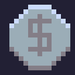

Once you have the metadata and image, they need to be publicly hosted so apps like
the wallet can grab them and display them to the user. If you are just testing things
you can try [JSON.bin](https://jsonbin.io/) to host the JSON, and I used
[imgur](https://imgur.com/) to host the image data in this example.

Once your JSON and image data are up, you can go back into the Unity editor and edit
the item by double clicking on it, or selecting the item and clicking **Edit**.

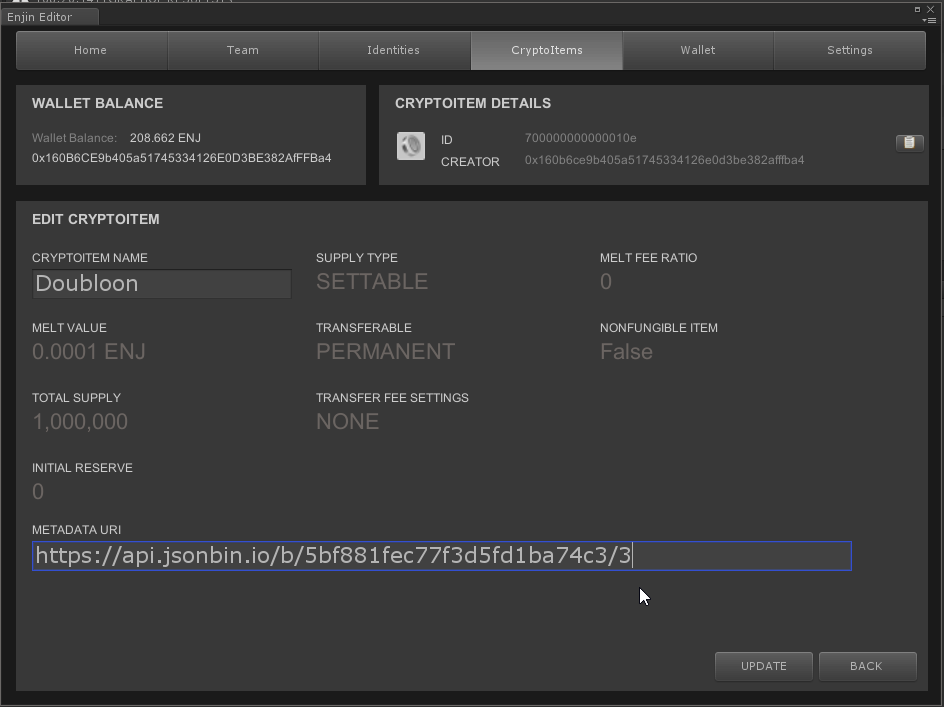

Paste the URI into the **METADATA URI** field and hit update. Setting or changing
the URI requires the owner to sign a transaction. If you are using the mobile wallet

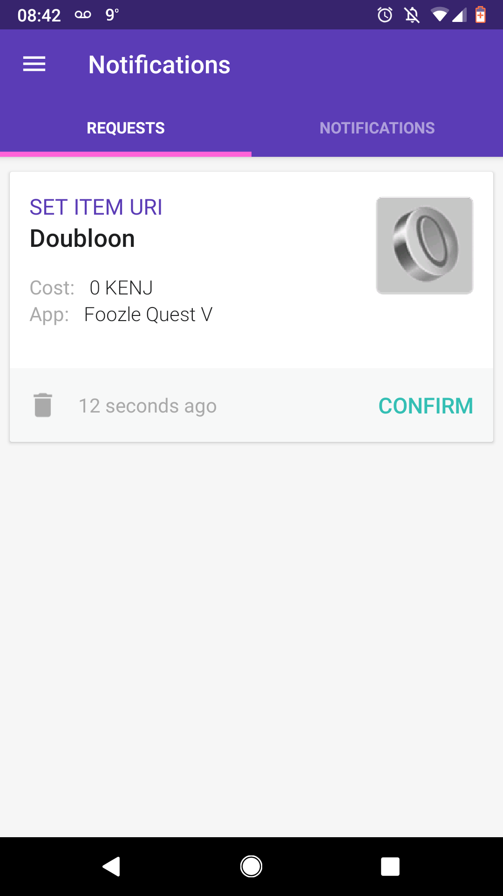

That's it! If you look at the collectible in the wallet, you should now see an image
and any metadata that you set.

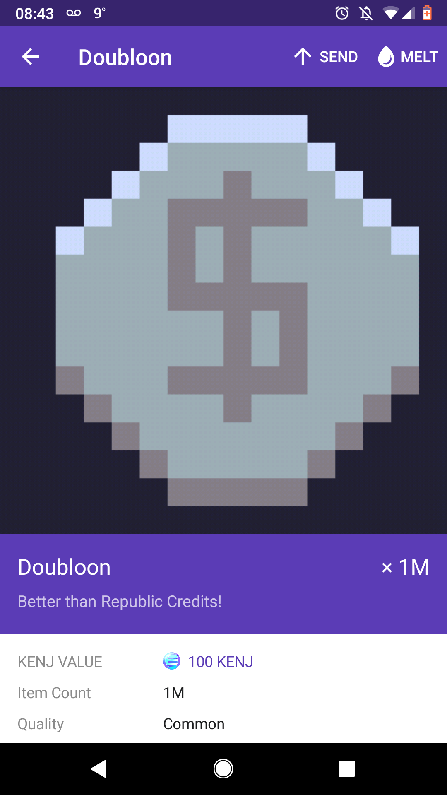

## Wallet Screen

The wallet screen shows the currently linked wallet to the given identity, along with
ETH and ENJ balances.

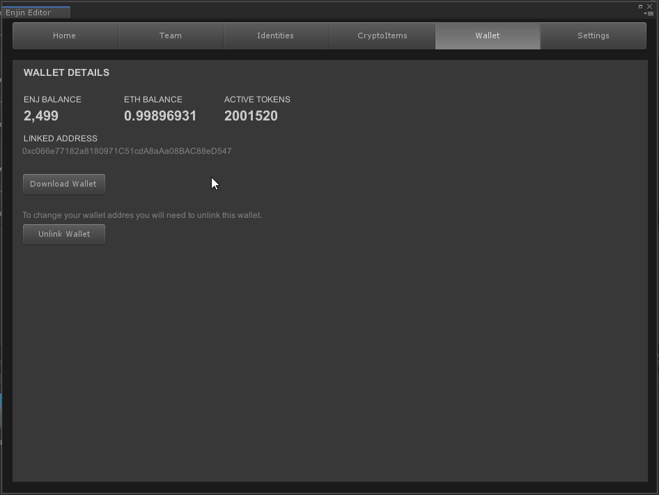

If unlinked, you'll see a link code like so:

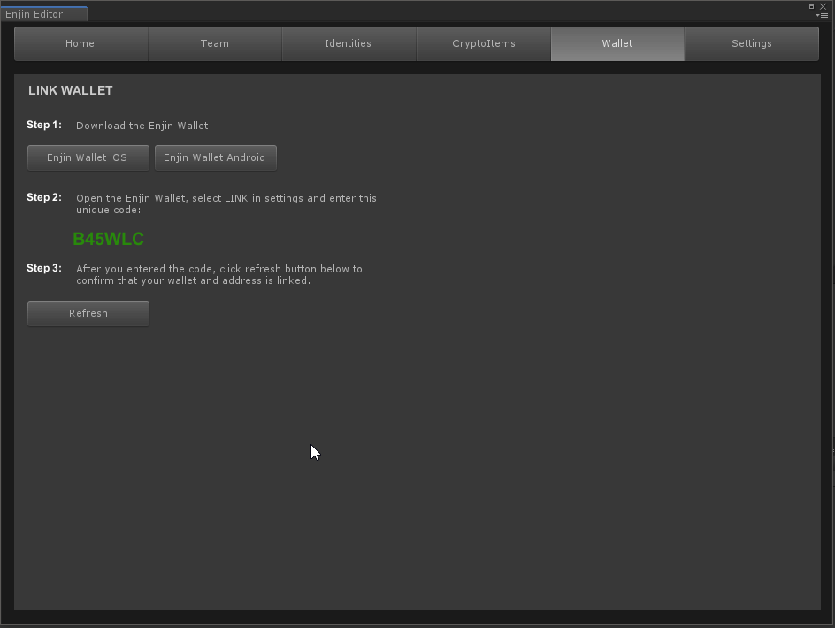

In the developer wallet, select LINKED APPS, then + LINK APP and enter the code and
follow the instructions. Click **REFRESH** in Unity to verify the link is successful.

If this is the first time linking this wallet to the platform, you will receive an **APPROVE ENJ** notification. Accept it. This will allow the platform to use your ENJ on your behalf to
do operations like creating and minting items.

## Settings Screen

We don't have much here at the moment.

# Using the Items

The items have been created, your parameters have been specified, and all of the foundations are ready for you to begin spreading your truly-ownable assets to players. It's time to [begin using your new items](using-items.md).
