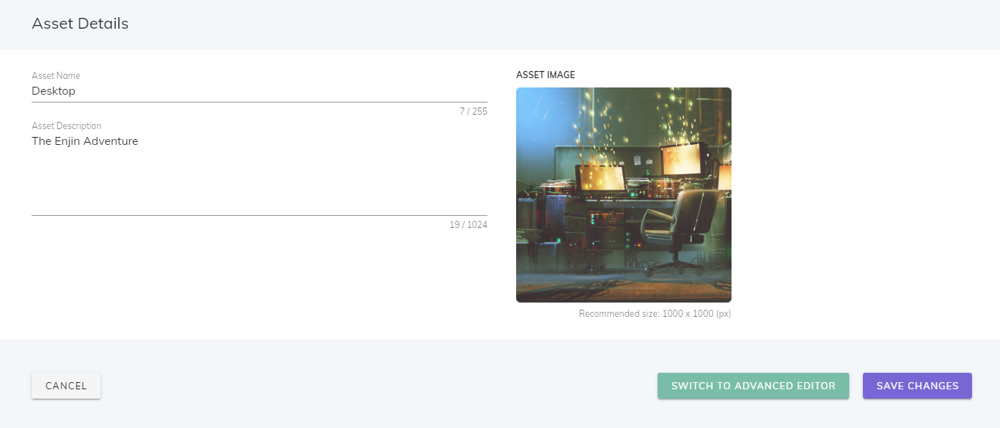
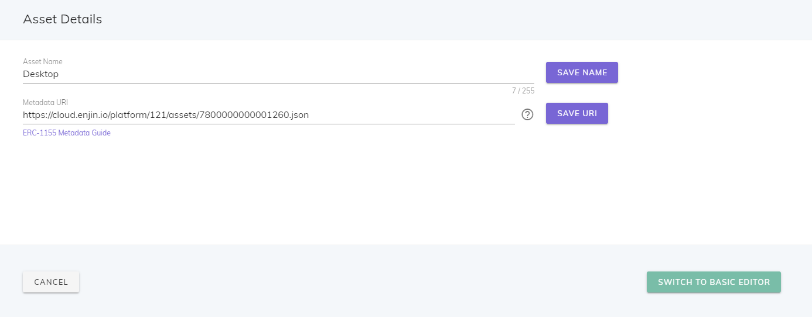

# Setting your Metadata

Assets made on the Enjin Platform may contain metadata that is based on the ERC721 Metadata JSON Schema. We are adding an optional formatting standard to this schema to increase efficiency for games that need to manage metadata for thousands of items.

Note the following requirements when it comes to metadata:

1. The link (to both metadata and image) must be publicly accessible to robots.
2. The uri must be set appropriately to the requested file.
3. The image must be that of a valid image file (the image must show).
4. The JSON must conform with the JSON RFC standards, if it does not conform in anyway then it won't be loaded.

You can view the following [section](https://github.com/ethereum/EIPs/blob/master/EIPS/eip-1155.md#erc-1155-metadata-uri-json-schema) which goes in depth about the ERC-1155 Metadata. 

### Setting your Metadata on the Enjin Platform

You can set your own unique, metadata on assets using the Enjin Platform. Once you have created a project and a few assets, you will notice that you will be able to "Edit" your newly created assets.

You will simply need to select a name, an asset description and an image (recommended size is 1000x1000 (px)). Check the following example:



Your metadata will be hosted by Enjin and you will be able to change your asset's metadata at any given time. 
Once done, a Set Uri notification request will be sent to your wallet. 
You will need to accept the request in your wallet, and the Set Uri transaction will broadcast on the blockchain. 

### Advanced Editor
Additionally, you can also host your own unique, metadata for your assets elsewhere, if you wish to not use Enjin as the service to host your files. 
Many game developers will often use their own hosting sites to store their asset's metadata, in which, we cater for with the use of the advanced editor on the Enjin platform. 

You can optionally set a name for your asset. Lastly, you will need to paste the .json file into the "Metadata URI" field and save the changes. Once done, a Set Uri notification request will be sent to your wallet. 
You will need to accept the request in your wallet, and the Set Uri transaction will broadcast on the blockchain. 
Once successful, your unique metadata will appear on your asset(s).  



**Note:** You can change your unique metadata at any give time, simply paste a new version of the .json file and click "Save Uri". 

### JSON Format 
We will proivde a simple run-down on an example of how your unique metadata can look. The main 3 factors that you will need, is an asset name, description and image. 

The properties name, description and image follows the ERC-721 metadata schema. Values in the properties JSON object, will be rendered in client applications, such as the [Enjin Wallet](https://enjin.io/products/wallet) and on [EnjinX](https://enjinx.io). 

Example Format:
```json
{
    "name": "Asset Name",
    "description": "Lorem ipsum",
    "image": "https:\/\/s3.amazonaws.com\/your-bucket\/images\/{id}.png",
    "properties": {
        "simple_property": "example value",
        "rich_property": {
            "name": "Name",
            "value": "123",
            "display_value": "123 Example Value"
        }
    }
}
```

### Specific Metadata URI
Any token ID may have a metadata URI that can be retrieved by calling uri(_id) on the ERC-1155 contract.

If an individual Non-Fungible token ID has a metadata URI defined, client apps should use this URI. If not defined, client apps should call uri(_id) on the base token id to retrieve the Default URI for the entire set of Non-Fungible tokens.

### Default URI
A Non-Fungible token that defines a Default URI in its base token has the option of using an {id} placeholder in the URI itself. This will get replaced with the distinct ID when accessing NFTs.

Example:

`yoursite.com/{id}.json` ->
`yoursite.com/0xbd4818c04f57a2ebc473d74ee06d6e0600000000000000000000000000000001.json`


### Images
If the Default URI contains an image property that in turn contains the {id} placeholder, the image URL will be used as the default image for all tokens of this type.

Example:

`yoursite.com/images/{id}.jpg` ->
`yoursite.com/images/0xbd4818c04f57a2ebc473d74ee06d6e0600000000000000000000000000000001.jpg`


The **image** property can also be a static URI without the placeholder, as desired.


In GraphiQL, you can set the URI for the item using the following mutation:

[Set Uri](../../../examples/SetItemUri.gql)

**Note:** Setting the URI is a blockchain transaction that you will need to approve in the Enjin Wallet, under the "Requests" tab, in order to see the metadata appear on your assets.
