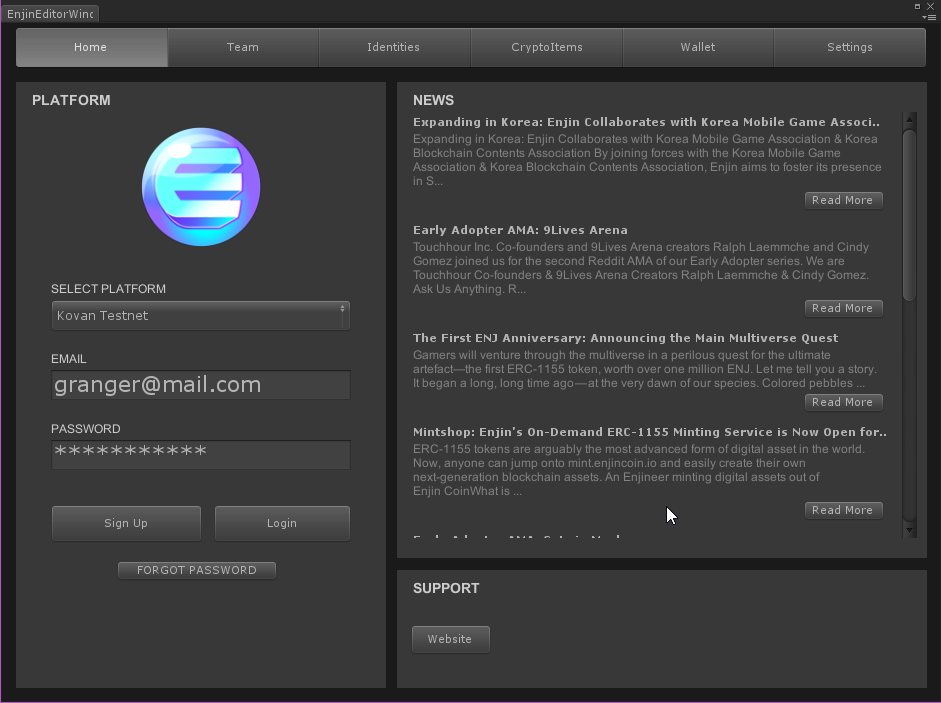
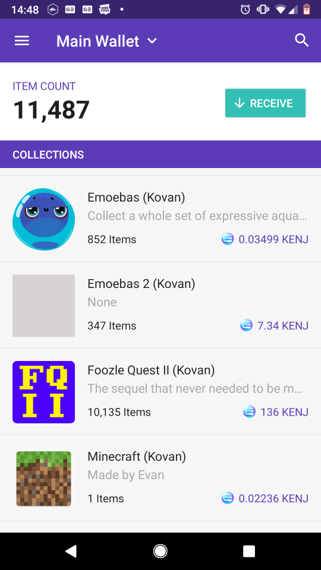

## What is Enjin Coin (ENJ)?

Enjin Coin is an ERC-20 Ethereum Token and Smart Contracts Platform based on then
ERC-1155 standard. Enjin is the best and easiest way to create and distribute
blockchain backed digital assets, so that you can empower yourself and your players
with the benefits of true digital asset ownership, a whole new frontier of game
development.

The easiest way to get the idea of ENJ is to pretend that it is a real world
material, like steel. Steel is used to make all sorts of useful
items in the real world, from weapons, nuts and bolts, to unique pieces of art.
Steel can also be bought, sold and traded with others at various markets.

ENJ is digital steel. ENJ can be bought, sold, and traded on exchanges.
ENJ can be used to make a million bullets, or to cast a one of kind sculpture. The possibilities are really only limited by your imagination.

## Why would I use ENJ?
Digital steel, so what? I can make an unlimited number of items in my game right
now, using better and faster technologies that have been around for decades.

Well, making things with ENJ is just the start. Think again of the real world,
and pretend the sword you have forged with ENJ is a real world object. What would be
the benefits to you as a creator? As a player? Here are a few:

* You created the sword from a material, therefore it has some value, however small.

* If you make 100 swords, that's how many there are in the world. There is a finite
number of them in existence. That's supply.

* If you have something of value and it has supply, you can expect demand for that item.
The demand might be small or large, it depends on the item, how it works in your game,
and what players are willing to pay for the item.

* Player who buy your sword really own it, you and your game could go offline tomorrow
and they would still have it.

* People can trade items with each other, without needing you to know about it. Actually
ENJ is better than the real world in this case because you, as the creator, can charge
a small fee every time one of your items moves from person to person!

* People can recycle items by melting them back in ENJ, allowing them to re-invest
ENJ into new games that they want to play.

These are just a few benefits at it's core, if you want a more extensive overview of
the of digital items check out this [video](https://www.youtube.com/watch?v=7KLpNU6wXEM).

## The ENJ Stack
To work with ENJ CryptoItems, you only need a basic understand of how blockchain
technology (in particular, Ethereum) works.

Look at this picture:

### Ethereum
Underlying everything is the open-source, public, blockchain based distributed computing platform called [Ethereum](https://en.wikipedia.org/wiki/Ethereum). You only really need to know some basic concepts about Ethereum to make your way around the ENJ platform, and you can learn those as you go.

### CryptoItem Smart Contracts
Smart Contracts are programs that run on the Ethereum "operating system". They are much like regular programs, and act as the low level building blocks that platforms like ENJ use to build their functionality. Enjin has championed a standard called [ERC-1155](https://github.com/ethereum/eips/issues/1155), proposed by Witek Radomski and the blockchain team here at Enjin. ENJ uses an implementation of ERC-1155 as the basis for the platform's functionality, called the
CryptoItem smart contracts. You don't need to know anything about smart contracts or how to program them to use ENJ, we do all the heavy lifting here for you.

### Cloud Platform
The Cloud Platform is the main backend service of ENJ that connects your game to the Ethereum network. The Platform acts as a hub, gathering requests from clients and game servers, interacting with the smart contracts on Ethereum, and returning data back to your game.

Currently, we are using a cloud based solution so the platform is hosted for you. You don't need to worry about setting up things yourself, all you need is an developer account and a subscription. In the future, we will be offering ways for developers to run their own self hosted platform(s).

### SDKs and APIs
The most basic way to talk to the Cloud Platform is by using our [GraphQL API](https://graphql.org/learn/). If you can use HTTP from your game to talk to a web service, you'll probably be able to talk to your Cloud Platform via this interface.

### Editor Tools and Runtime APIs
Over time our team of Enjineers will be creating all sorts of tools and APIs for all of the most frequently used game technology out there. For now, the focus is on the Unity engine. We provide a Unity API, and an editor UI Panel to help you do the most common operations with the ENJ platform. If you are not using Unity, you'll want to use the GraphQL API for your game.

### ENJ Wallets
One concept to learn when working with the blockchain is the idea of having a wallet address a private key. Think of your wallet address as the street address for your garage of stuff. But it's more than that, because each garage comes with a private key. The private key is solely controlled by the wallet owner, YOU! You use your private key to access the contents of your wallet, but also to authorize and sign transactions that involve your items. For most players and some developer tasks, like creating items, you'll probably use the Enjin wallet mobile app for Android and iOS.

For your game itself, you'll want to use the Enjin Wallet Deamon to automate most of these operations in a secure and convenient way.

### YOUR GAME
Which brings us to the bottom of the stack, where the rubber meets the road, your GAME! The nice thing about our platform is that it is not an all or nothing thing, you can choose how deeply you want to integrate ENJ into you game, over as long of a period as you wish. Maybe start with a vanity item or achievement token that is given to players upon purchase or completion of your game?

# How do I get started?

  Still here? Great! We'd love to have you! You can get up and running on our platform in three easy steps.

  #### Sign Up

  Sign up and subscribe [HERE](https://feature-front-end.tp-enj.in/#/signup).
  This will give you an account so you can access the Platform.

  #### Create a Wallet

  You'll then need to create at least one wallet.

  See our [Wallet Quickstart](./wallet_quickstart.md) guide on how to setup and
  fund your wallet.

  #### Pick your SDK.

  Finally, you need to decide how you are going to interact with the ENJ platform. You'll probably use all of these platform interfaces at one time or another, but here
  are your main options:

  * If you are a Unity developer, you can use the Unity SDK, which is free on the Unity asset store. Guide is [here](./unity.md).

  * You can work with the Platform API via browser based GraphiQL console. Guide is [here](./cloud_platform.md).

  * You can use Node to work with the Platform API directly, a guide is [here](./node_sdk_examples.md).
