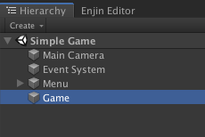
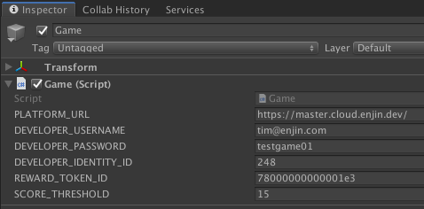
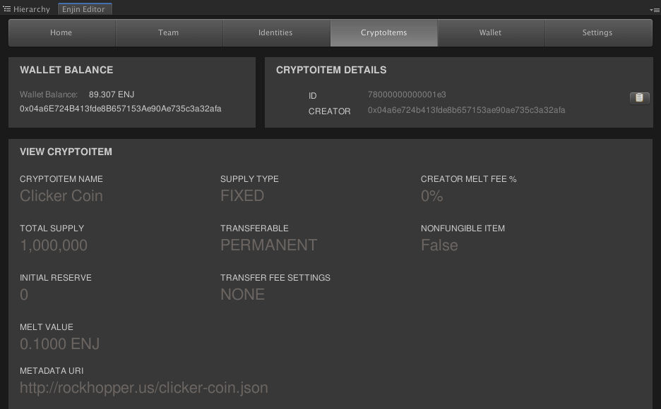
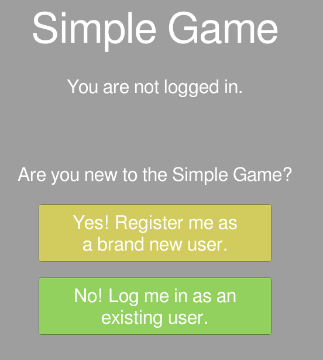
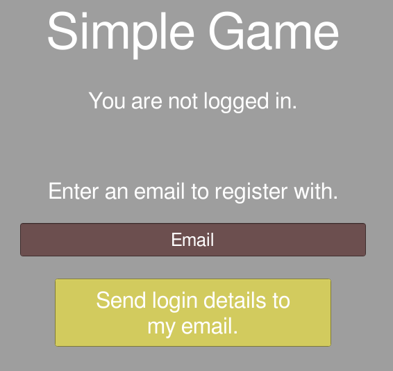
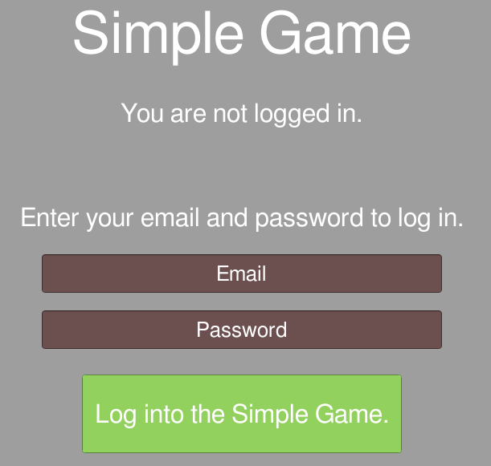
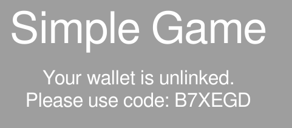
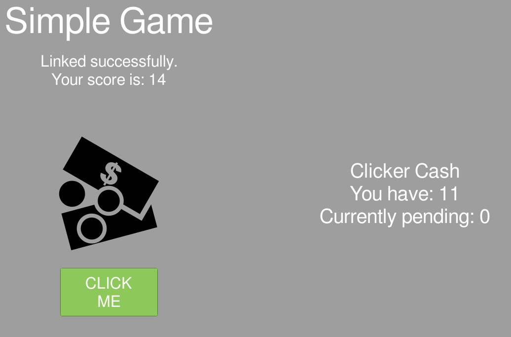

# Using Enjin Items in Your Unity Game

Now that you've [created your items](creating-items.md), it's time to walk through the Unity SDK and how to use it to build your project. By now you have set up your Trusted Cloud account, created your app, funded and linked your wallet, created at least one type of item you can mint, and are ready to proceed with the Unity SDK.

# The Simple Game

To begin exploring the Unity SDK more thoroughly, we're going to look at an example of a very simple game. Included in the Unity SDK is an example under the _Assets > Enjin > Enjin SDK > Simple Game_ directory. Included in that directory is a Unity scene configured as a simple clicker-style game and the assets that give it functionality. Most important is the _Game.cs_ file which demonstrates proper use of Enjin's Unity SDK through scripts.

The Simple Game scene itself is quite a straightforward example. Players are presented with an authentication screen to either newly register an account for the app or to log in with an existing Enjin Trusted Cloud account. Next, players are presented with an in-game prompt to link their Enjin mobile wallet to the Simple Game. Lastly, gameplay begins whereby players can earn freshly-minted reward items after clicking a button a certain number of times.

# Required Setup Information

To get this game working with your own token that you've created, you'll need to update some configuration options. First, open the _Simple Game_ scene in the Unity editor and select the Game object from the Unity hierarchy panel. This object is a Unity [GameObject](https://docs.unity3d.com/ScriptReference/GameObject.html) with our example script attached to it. Once selected, you can populate the required fields that appear in the Unity inspector panel.

|||
|:-:|:-:|
|The Game object as seen in the Unity hierarchy view.|The Game object configuration variables in the Unity inspector.|

These configuration variables are all exposed through and used in _Game.cs_.

* `PLATFORM_URL`: this variable specifies which Trusted Cloud the Enjin SDK should attempt to connect to and interact with. A sensible option for testing is our server on the Ethereum Kovan test network, `https://kovan.cloud.enjin.io/`.

* `DEVELOPER_USERNAME`: this variable specifies the developer's username on the selected Trusted Cloud server. In this example game, this should be your username.

* `DEVELOPER_PASSWORD`: this variable specifies the developer's password on the selected Trusted Cloud server. Together with the `DEVELOPER_USERNAME`, this variable provides the credentials needed for the Enjin SDK to authenticate on the developer's behalf. Following this authentication, the SDK can perform such administrative tasks as programmatically minting new items for players. In this example game, this should be your password.

* `DEVELOPER_IDENTITY_ID`: this variable specifies which Identity of the developer should be used for minting reward items. This is an important concept because Users on Enjin's Trusted Cloud servers can all have multiple Identities. Each Identity specifies an Ethereum address to use as its wallet, so this variable specifies to the Enjin SDK which wallet contains the reward items. This value can be retrieved by looking for your developer entry in the _Teams_ tab of the Enjin SDK editor window for your app.

||
|:-:|
|This is where you can find your developer Identity ID.|

* `REWARD_TOKEN_ID`: this variable specifies which of the developer's Items should be minted as a reward to players who have clicked enough times. The developer must be able to mint more instances of this Item using the selected `DEVELOPER_IDENTITY_ID`. This value can be retrieved by viewing your reward Item under the _CryptoItems_ tab of the Enjin SDK editor window for your app.

||
|:-:|
|This is where you can find your reward token's ID.|

* `SCORE_THRESHOLD`: this variable specifies how many times the player must click before earning a reward item in the Simple Game.

Once the configuration variables have all been populated, the Simple Game example is configured to reward clickers with the token of your choosing.

# A Simple Game Walkthrough

The best way to gain an understanding of how the Enjin SDK is used in this Simple Game example is to configure and run the example itself in the Unity editor. The game includes some built-in tutorial text describing what it is doing. Included here is a further look at the several different steps where Simple Game interacts with the Enjin SDK. These are the same steps that you will want to follow in using the SDK to support true Items in your own game.

First, the Enjin SDK can be leverage as an account system for your app.

||
|:-:|
|The player is first presented with a screen showing authentication options.|

The account system is robust and supports the notion of a single set of credentials for the player or end user internally backed by multiple Identities and addresses across multiple apps. When encountering your app for the first time, a player can request that their email be registered to the app. The Enjin SDK will transparently support creating for the player a new User containing a single Identity associated with your app. The player will receive their account credentials by email.

||
|:-:|
|If the player is new, they are prompted to register by email for the Simple Game app.|

In the event that the player had an existing account on the Enjin Trusted Cloud server, the registration event will create under their existing User a new Identity associated with your app. Instead of receiving account credentials, the player in this case will receive notification that they've successfully linked to your app and can proceed to log in as normal.

||
|:-:|
|The player can also choose to log in with their existing account.|

Whether newly-registered or not, it is possible that the player's Identity associated with your app does not yet track an Ethereum address. In such a case, the Enjin SDK can retrieve a linking code that the player is prompted to enter in their Enjin mobile wallet.

||
|:-:|
|If the player logs in but has no associated wallet, they are prompted to link one.|

Once the player has linked the wallet to the app, an event is detected which automatically progresses the game to the main play state. This part of the Simple Game demonstrates how to retrieve the name, image, and balance of the particular reward item that the player is clicking towards.

||
|:-:|
|The game view as the player interacts with it.|

When the player accumulates enough clicks, gradually uncovering the image of the reward token, the developer Identity specified in the Simple Game configuration variables will mint one reward token to the player. The developer will be prompted in their wallet to either accept or deny this mint operation.

This page also shows how the player ought to be notified about which operations are pending settlement on the Ethereum network. In this case, every time the player earns a token it is first represented in the "pending" state until the developer approves of the mint.

# Additional Resources

Many of the Unity SDK methods are also available as direct GraphQL calls in our [live documentation](https://github.com/enjin/Enjin-Coin-Documentation/tree/master/live_query). The live documentation is a good resource for more in-depth examples of interacting directly with GraphQL on the Trusted Cloud.

In practice, any game like this will want to use a deployed instance of the Enjin Wallet Daemon to automatically accept or reject game item transactions. Let's walk through a more advanced example on how to set that up.
