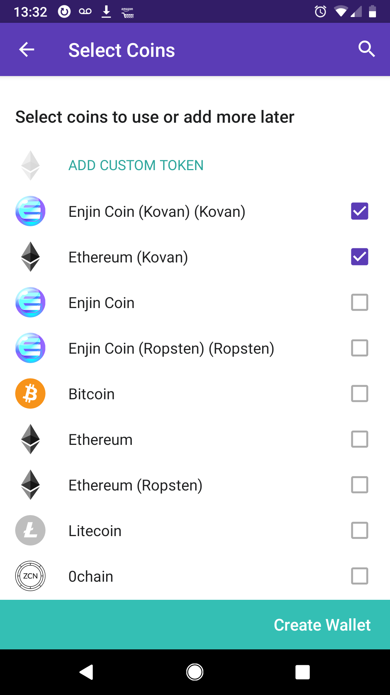
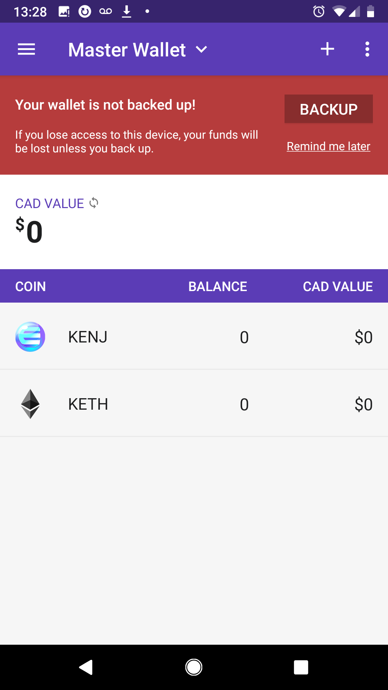
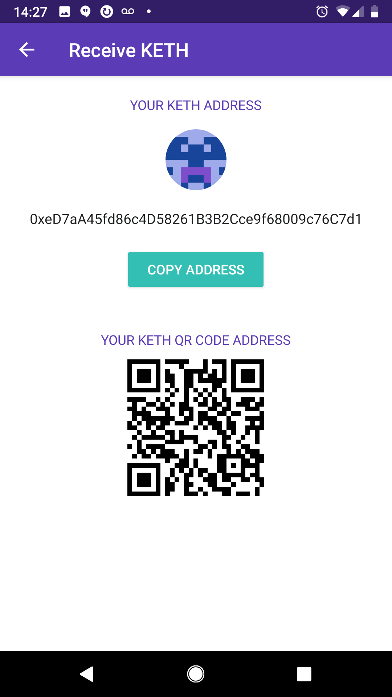

# Connecting Your Enjin Wallet

The Enjin wallet provides an intuitive signing process that makes it easy to execute complex blockchain operations via Enjin's smart contracts.

Most operations that involve a transfer of value or alteration of blockchain data or metadata will need to be authorized via the blockchain, which means an approval request will appear in your Enjin Wallet.

## Creating your Wallet

### Install the Enjin Developer Wallet

You can get the latest version of the Enjin Wallet on both Android and iOS from the Play Store and App Store

For Android devices, you can also install the app by [downloading the APK](https://enjinwallet.io/apk.html). 

You'll need version 1.3.7.20316 or later with developer mode enabled to communicate with the Enjin Platform.

### Enable Developer Mode
To enable developer mode in the wallet head to the settings screen and tap the version number in the bottom right corner 10 times. 

Developer mode is needed in order to link to the Trusted Cloud and enable other developer related features and functions. Developer mode is available on both Android (1.3.7) and iOS (1.3.0).

### Create a wallet
- If this is your first wallet, select the _Create Wallet_ option. 
- If this is not your first wallet hit the selector on the right, tap Manage Wallets, and tap the + symbol in the lower right. Then select _Create Wallet_.

Give the wallet a name that stands out, like "Master Wallet".

- If you are working on Testnet, select _Ethereum (Kovan)_ and _Enjin Coin (Kovan)_ for Coins. Then tap _Create Wallet_.
- If you are working on Mainnet, select _Ethereum_ and _Enjin Coin_ for Coins. Then tap _Create Wallet_.

Enter a password for the wallet.

You have now successfully created a wallet.

### Backup the Wallet
It is imperative that you take a minute to save and protect your private keys (12 keywords). 

* If you do NOT backup your wallet and your device is lost you will **NOT BE ABLE TO RECOVER** your cryptocurrency and items. 
* If anyone else gains access to your private keys they will be able to steal your cryptocurrency and items.

### Get Your Ethereum Address
To Find your Ethereum address;
1. Tap _Wallets_. 
2. Tap either the _ETH_ or _ENJ_. 
3. Then tap _Receive_ in the top left. 
4. Copy this address.

_NOTE: Your Enjin Coin and all of your blockchain assets are running on Ethereum so they are also managed within the same address._

### Fund Your Wallet

Fill your wallet with cryptocurrencies that pay for your necessary blockchain transactions.

ETH/KETH is used to pay for transaction fees on the network, while ENJ/KENJ is used to create and back your items. 

**Kovan Testnet:** To begin transacting on Testnet will need KETH (Kovan Ether) and KENJ (Kovan Enjin Coin). To receive these free resources, go to the [Enjin Kovan Testnet Faucet](https://kovan.faucet.enjin.io/) and input your Ethereum address.
**Ethereum Mainnet:** To begin transacting on Mainnet, you will need ETH (Ether) and ENJ (Enjin Coin). You can purchase these from a cryptocurrency exchange.

# Linking Your Wallet

Every user of your Enjin App or collection requires an app identity which allows you to identify them as the true owner of their Ethereum address.

Identities are distinct from user ids, and are a way to decouple users from wallet
addresses. Identities are either linked, or unlinked. If they are linked, they
contain a valid Ethereum address. Unlinked identities have a like code like `BXXAZK`.
It is important to know that **there can only be one identity per user, per app/game.**
You cannot directly connect a user id to a wallet.

For example, user `bob` can link
his wallet `0xabcd`to the game `Space Monkies`, but cannot link multiple wallets to
that particular game.  If `bob` wants to use a different wallet with `Space Monkies`,
he will need to unlink the current wallet, and re-link with the new wallet.

An identity will automatically be created for new users if you set an app id when creating the user.

To accept and sign any transactions, you will need to link your Enjin Wallet (Dev version) app to your identity. To do this, you will need to find your **Linking Code**.

You can find the link code with the following query:

[Identities](../examples/Identities.gql)

You should be given a 6 character linking code to enter into your dev wallet app in the **LINKED APPS** section. Mainnet code starts with “A”, while Kovan starts with “B”. You will need to choose which wallet to link (if you have multiple wallets imported).

To reset your linked wallet, use the following query.
[UnlinkIdentity](../examples/UnlinkIdentity.gql)

## Approving ENJ
To prepare for item creation, you will need to pre-approve ENJ to the CryptoItems smart contract.  When linking your wallet for the first time an approve transaction will automatically be created for you to sign.  If you check the **REQUESTS** section of the wallet you should see and APPROVE ENJ transaction ready to sign.  Accept the transaction request to approve the ENJ.

By default the automatic approval transaction will approve the maximum amount of ENJ possible.  If you wish to change the pre-approval amount you will need to make sure you have set approval to 0 first before approving your actual value (use -1 for max ENJ possible). You do not need to multiply value by 10^18 for this request. You don’t need to do this if you have previously approved a sufficient amount of ENJ to use (i.e approved
wallet transaction above)

[ApproveENJ](../examples/ApproveENJ.gql)

Once a successful request has been made, you will need to accept and sign the transaction in the **REQUESTS** section of your dev wallet.

# Creating Items

Your game is ready, your wallet is ready, and soon your items will be ready. In our next guide, we will walk you through the [process of creating items with Enjin](creating-items.md).
