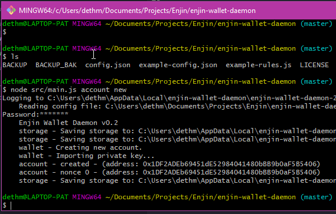

# Wallet Quickstart

As mentioned in the [Start Here Guide](./starthere.md), you will need at least one Enjin wallet to work with the platform, but it is a good practice to consider *two* wallets: one Master wallet, and a secondary Item Vault wallet.

The Master Wallet uses the Enjin Developer Wallet Mobile App (found here), and is used to
store the ENJ/ETH you are using to craft your cryptoitems, as well as assist in the creation
and minting of your cryptoitems. For example, you would use this wallet to create your in-game
currency, and any items you would want interactively.

The Item Vault wallet is an instance of our wallet deamon running on a secure server that you
control. This is a hot wallet that is used with your game at runtime to automate signing of
transactions dealing with cryptoitems for you game.

This guide assumes you are running on the testnet beta platform on Kovan testnet.

## Creating the Master Wallet (Required)

### Install the Enjin Developer Wallet

Grab the latest version of the developer wallet from [HERE](https://drive.google.com/open?id=17l8pSm2_1m8VF7dH1p9TIdjZDjSja4Tt).

### Create a wallet
If this is your first wallet, select Create Wallet option. If this is not your first
wallet hit the selector on the right, tap Manage Wallets, and tap the + symbol in the
lower right. Select Create Wallet.

Give the wallet a name, like Master Wallet.

Select Ethereum (Kovan) and Enjin Coin (Kovan) for Coins. Tap Create Wallet.

Enter a password for the wallet.

The wallet is created.

### Backup the Wallet
It is highly recommended that you back up your wallet using the 12 keywords. If you
do NOT backup your wallet and your device is lost you will **NOT BE ABLE TO RECOVER** your
cryptocurrency and items.

### Fund the Wallet

The next step is to fund the wallet with ETH (Ethereum) and ENJ (Enjin Coin). ETH is used
to pay for transaction fees on the network, which ENJ is used as the digital casting material
to create your items. You'll need both to use the platform successfully and both are provided
for free on testnet.

Find your wallet address by tapping WALLETS. Tap either the ETH or ENJ entry. Then tap
RECEIVE in the top left. Copy this address.

Go to [Enjin Kovan Testnet Faucet](https://kovan.faucet.enjin.io/) and paste your address.

In a couple of minutes, you should have both Kovan ETH and ENJ in your wallet. You are now ready to use the platform to make items.

## Creating the Item Vault (Optional)

It is highly recommended that you create an Item Vault wallet on a secure server that you
control somewhere. This does not to be on the same machine as you game server or
any other service. The Item Vault will receive items that you mint on the Master Wallet,
and will automatically sign incoming transactions without user intervention.

Once you secure a server you want to install the Item Vault on, look at
[this guide](./wallet_ademon_install.md) on how to install the wallet daemon on
that machine.

After installation, you'll want to use [this guide](./wallet_daemon_first_steps.md)
to create your wallet and/or import a private key from another wallet. Go up to
the "Link To Trusted Platform" step, as you will need to create a new user for the
Wallet Deamon later on.

Fund the new Item Vault wallet using the [Enjin Kovan Testnet Faucet](https://kovan.faucet.enjin.io/) by pasting you new item vault address like you did with
your main wallet.

You can use the ENJ mobile wallet to watch your Item Vault wallet. You'll need the mobile
wallet installed on a compatible mobile device to do this. Once in the wallet, watch you wallet daemon Ethereum address like so:

1. WALLETS -> Manage WALLETS.
2. Hit + and WATCH wallet.
3. Enter a name for the wallet you want to watch. i.e. Item Vault.
4. Enter the ETH address of the daemon wallet.

## Next steps

If you are using Unity, head over to the [Unity Guide](./unity.md).

If you are not using Unity, check out the [Trusted Platform Guide](./cloud.platform.md)

Think of a wallet as a garage or storage locker for your cryptocurrency, in this case
Ethereum, and EnjinCoin, along with all of your cryptoitems that you will be creating

You have multiple options here: if you are just starting out with the platform and if you think you will be doing a low number of operations and want to get a feel for how things work manually, grab the developer version of the mobile wallet [HERE](https://drive.google.com/open?id=17l8pSm2_1m8VF7dH1p9TIdjZDjSja4Tt). The mobile wallet is also handy for watching other wallets, for example, your server side wallet daemon.

If you are doing a high number of transactions, or need to automate transaction signing for game severs interacting with players, you should use our wallet daemon. Check out our [wallet daemon guide](./wallet_daemon_guide.md) for how to get started with that.

Wallets need ETH to pay for transactions, and ENJ as the digital casting material to create your items. If you want to experiment our Kovan testnet sandbox before using real currencies you can get some KENJ and KETH from our faucet [here](https://kovan.faucet.enjin.io/) and be off to the races.

If you want to use real deal, mainnet, you will need actual ETH and ENJ via an exchange.
