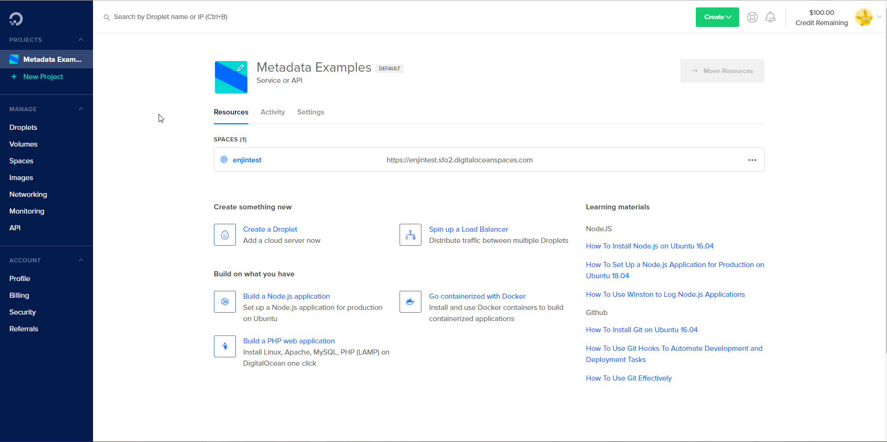
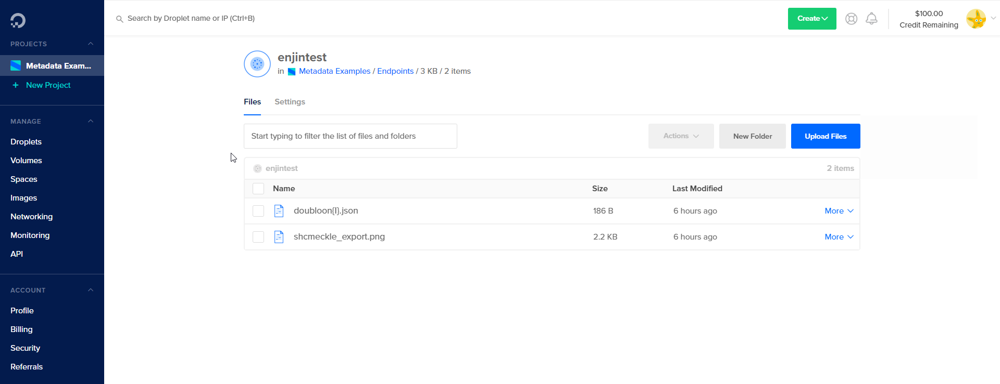
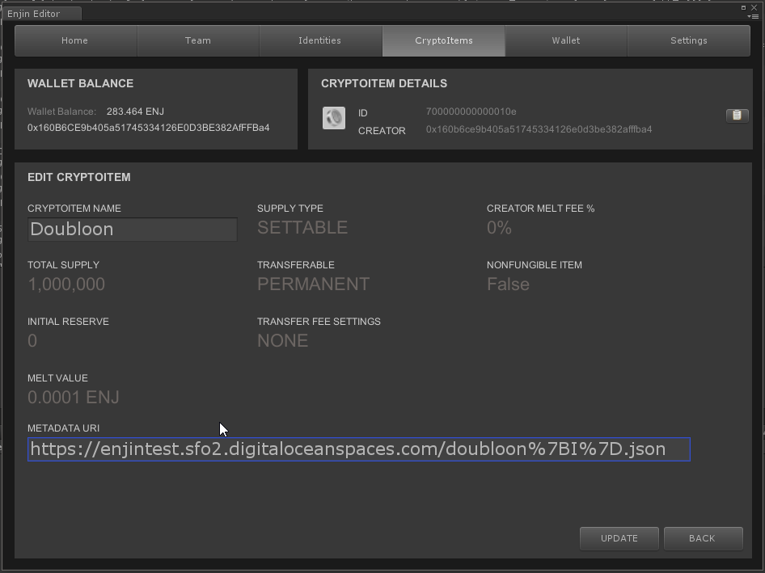

# Working with Metadata - Digital Ocean

This guide will show you how to host JSON metadata and images for your items
using [Digital Ocean](https://enj.in/digital-ocean) Cloud Services. This is not the only
way to host your data, but should provide an easy, yet robust way for developers that
are less familiar with web technologies to fully take advantage of item metadata.

You can look at the full JSON schema for metadta over [here](./erc1155_metadata_json_schema.md).

## Getting Started
Create an account on Digital Ocean.

Once you have an account, create an new
project for you game, and then create a [Space](https://www.digitalocean.com/docs/spaces/).

Your screen should look something like this:



## Uploading Files
Click on the Space to access.

Upload your images first, since you will need to set the `image` field in your JSON to the URL of you image.

Set permissions to Public.

Modify your JSON data to point to the appropriate images on like so:

```json
{
  "description": "Hello from Digital Ocean!",
  "image": "https://enjintest.sfo2.cdn.digitaloceanspaces.com/shcmeckle_export.png",
  "properties": {
    "Quality": "Common"
  }
}
```

Upload your finished JSON to the Digital Ocean Space. It should look something like this:



## Setting URIs and Testing

In Unity, select the item and hit EDIT. Fill in the URI field.



In the Platform API (GraphQL), you can set the URI for the item like so:

[CreateToken](../examples/CreateToken.gql)

Note that in either case setting the URI is a blockchain transaction that you will need to approve.
